性能那些事儿
============================

商业化的数据库喜欢通过性能测试搞大新闻，动不动就是比竞争对手快多少多少倍，当然竞争对手也有类似的性能测试。我们不干这事。第一，我们作为一个开源软件，这种空洞的新闻意义不大；第二，这种新闻除了“信我，用我”式的传教之外，并不能给用户带来什么真正的好处。我们希望，我们的性能测试对用户而言有一定的实用性，能让用户自己回答以下问题：

-  在我的应用场景中，使用 Cozo 时都有哪些选择？这些选择的优劣都是什么？
-  用我手上现有的机器跑我需要的查询，大概能达到什么样的性能？

准备工作
---------

我们所有的性能测试，都是拿不同设置的 Cozo 互相比较。我们用来跑测试的机器有下面这两台：

-  一台 Mac Mini（2020 年产）
-  一台 Linux 服务器（2017 年产）

Mac Mini 的操作系统为 MacOS 13.0.1，使用苹果 M1 处理器，4 个性能核，四个功效核，16GB 内存，存储是一个挺快的 NVMe SSD。它所代表的性能是不太旧的台式机、笔记本的性能。Linux 服务器的操作系统为 Ubuntu 22.04.1 LTS，使用量块 Intel Xeon E5-2678v3 处理器，共 24 个物理核，64GB 内存，存储是我们见过最慢的 SSD。如果你的服务器比较旧，或者你租用了云服务商溢价的高端云主机，那么性能应该和这台机器有类似之处。自己精心配制的新的服务器应该比我们这台快得多。

测试时我们嵌入式地通过 Rust 来调用 Cozo（我们直接用了 Rust 内置的性能测试框架）。由于是嵌入式地使用，我们通过调整分配给查询任务的线程数来测试某项工作的性能与所用处理器数量之间的关系。当然，使用 Rust 嵌入式地调用 Cozo 意味着测试时几乎没有什么额外性能损耗：如果通过 Python 等来调用，则额外性能开销还是比较明显的。尽管如此，在差不多的硬件条件下，不管什么语言环境中的性能都应该是同一个数量级的，否则就应该是 bug，如果发现了请告诉我们。

众多图数据库都喜欢用 `斯洛文尼亚 Pokec 社交网络 <https://snap.stanford.edu/data/soc-pokec.html>`__ 的数据来做性能测试（比如 `这个 <https://github.com/memgraph/memgraph/tree/master/tests/mgbench#books-datasets>`__ ，还有 `这个 <https://www.arangodb.com/2018/02/nosql-performance-benchmark-2018-mongodb-postgresql-orientdb-neo4j-arangodb/>`__ ）。我们会用这个数据集的几个不同的子集来测试：

-  “微型集”：1 万个顶点，12 多万条边；
-  “小型集”： 10 万个顶点，176 多万条边；
-  “中型集”：163 多万个顶点，3062 多万条边（这是数据的全集）。

数据的分割与 `这个测试 <https://github.com/memgraph/memgraph/tree/master/tests/mgbench#pokec>`__ 里面的实际上是一样的，但是他们的“小型集”在我们这里叫“微型集”，他们的“中型集”在我们这里叫做“小型集”，他们的“大型集”在我们这里叫做“中型集”。我们这么命名的原因是，“大数据时代”喊了这么多年了，将一个区区 3000 多万条边的数据集叫做“大数据集”，实在是有些自欺欺人。当然我们也希望能在真正的 `大数据集 <https://www.tigergraph.com/benchmark/>`__ 上测试：不过先等我们钱包更鼓点吧。对于一般的应用来说，我嫩测试的“中型集”也不算小了。

数据库的结构由下列 CozoScript 建立：

::

   {:create user {uid: Int => cmpl_pct: Int, gender: String?, age: Int?}}
   {:create friends {fr: Int, to: Int}}
   {:create friends.rev {to: Int, fr: Int}}

如果你还不太了解 CozoScript 的语法：第一个表名为 ``user`` ，主键是个整数，除了主键之外还有三列；第二个表名为 ``friends`` ，有两个整数列组成的组合主键，数据表示人之间的关系；第三个表为 ``friends.rev`` ，存储内容与第二个表相同，但是列的顺序相反，可以作为反向索引使用（Cozo 对索引的使用都是显性的，详见文档）。

我们会测试以下三种不同的存储引擎：

- 基于内存（Mem）的非持久性存储引擎
- 基于 SQLite 的存储引擎
- 基于 RocksDB 的存储引擎

Cozo 中的所有查询都满足快照隔离：即当并发读写时，所有的读写操作都只能读取当前事务开始之前已经写入的数据，加上当前事务中自己写入的数据，且如果两个写操作对相同的行做出了修改，则至少有一个操作会失败，这个操作不会有任何修改被写入数据库。在测试时如果遇到这种失败，我们会重试至成功为止。目前 Cozo 只支持这一种一致性：没有办法放松一致性来进一步提高性能。

在测试中，所有的写操作只有在数据持久化之后才会返回：我们不搞“打一枪就跑，存没存进去不知道”的小动作来抬高性能。

我们只测试 Cozo 的“开箱即用”配置。实际上，可以通过配置 RocksDB 存储引擎来进一步优化性能，但是这种优化过于复杂，对于一般的用户来说意义也有限。

完整的测试结果在 :download:`这个表里 <files/cozo_perf.xlsx>` ，你可以下载下来自己分析。

数据载入
------------

批量载入
~~~~~~~~~~~~

第一个测试是：完全导入数据需要花多久（要不要等上好几天）。在这个测试中，我们从文本文件中读取原数据，再以 300 行一组，单线程分批插入数据。

在微型集上，结果如下：

========  ======= ====================
平台      引擎    耗时（秒）
========  ======= ====================
Mac Mini  Mem     0.265788
Mac Mini  RocksDB 0.686022
Mac Mini  SQLite  6.383260
服务器    Mem     0.494136
服务器    RocksDB 1.285214
服务器    SQLite  27.971535
========  ======= ====================

在小型集上，结果如下：

========  ======= ====================
平台      引擎    耗时 (秒)
========  ======= ====================
Mac Mini  Mem     5.429186
Mac Mini  RocksDB 11.752198
Mac Mini  SQLite  146.848621
服务器    Mem     8.741262
服务器    RocksDB 19.261249
服务器    SQLite  432.705856
========  ======= ====================

在中型集上，结果如下：

========  ======= ====================
平台      引擎    耗时 (秒)
========  ======= ====================
Mac Mini  Mem     155.894422
Mac Mini  RocksDB 212.731813
服务器    Mem     219.956052
服务器    RocksDB 348.638331
========  ======= ====================

因为我们很没耐心，所以我们根本没测 SQLite 引擎在中型集上需要多久。根据上面所现的规律，我们可以给出一个大概的估计：用 SQLite 引擎导入中型集，如果用的是 Mac Mini，则大概要 45 分钟，如果是服务器则要两个多小时。这让 SQLite 看起来很差，但是实际上是其他两个引擎表现太好了：我们之前在往其它某个图数据中导入相同数据的时候用了半天的时间，即使我们再不会用，这速度也太离谱了。

实际上如果你非要使用 SQLite 引擎，也有导入数据快得多的方法，后面会介绍。

如果用的是 RocksDB 引擎，则几分钟之内几千万行的数据就被搞定了。我们觉得这挺快了。

我们可以在数据集之间纵向比较性能：不再看总耗时，而看每秒能导入多少行。注意每个边算作两行，因为我们需要往两个表中插入同一条边：

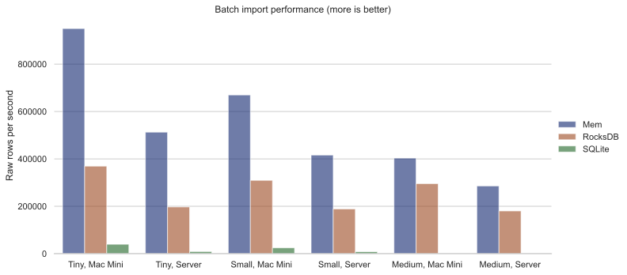

我们可以看出 RocksDB 的性能表现非常好，尤其是在数据集变大时：大数据集对于单位时间内处理行数的影响很小，且比起完全不往硬盘上写内容的 Mem 引擎来，也只慢了三倍左右。

有些人可能会说，这么测对 SQLite 引擎不公平，因为如果允许调参数、改变插入方式的话，SQLite 的数值不会这么低。但是我们的原则就是测试“开箱即用”的性能，而且 RocksDB `参数 <https://github.com/cozodb/cozo#tuning-the-rocksdb-backend-for-cozo>`__ 的种类更多，性能上升空间更大。

在整个导入过程中，占用了多少系统内存呢？以下我们给出操作系统记录的进程的峰值内存使用量：

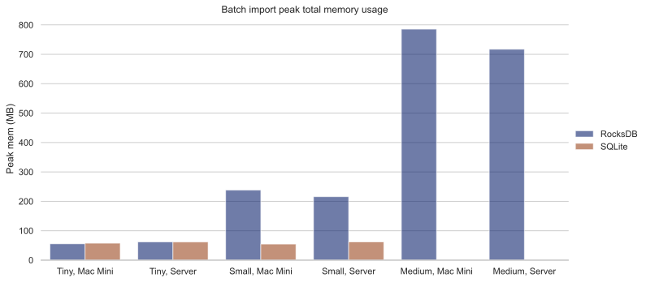

实际上数据库本身用的内存比图中显示的还少：测试框架本身就会占用大概 50MB 内存，即使什么也不干。所以实际上 SQLite 引擎使用的内存接近于 0，而 RocksDB 则确实用了一些内存作为缓存。图中没有 SQLite 对于中数据集的数据，原因之前已经说过，等太久，没耐心了。

纯内存存储引擎的内存峰值如下：

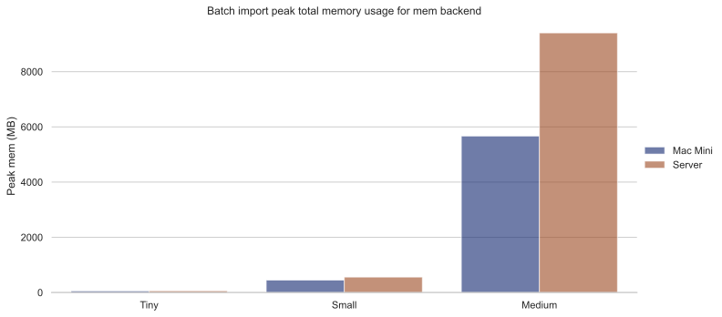

我们将这个结果单独列出来，因为实际上这就是整个数据集在内存中大概的大小。我们可以看出苹果平台在内存使用上似乎更节省一些。在下面的测试中，当我们展示内存相关的结果时，我们不会展示纯内存引擎相关的数据，因为纯内存引擎的内存使用基本完全取决于存了多少数据，也就是说数据都和这张图差不多。如果你想看更详细的数据， :download:`文件 <files/cozo_perf.xlsx>` 里面有。

备份
~~~~~~

Cozo 的备份文件就是一个 SQLite 的引擎文件。生成速度如何呢？

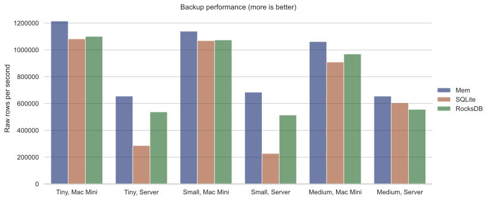

在 Mac Mini 上，不管什么引擎都可以达到每秒一百万行以上的性能，对于大多数应用来说这大概足够快了。而在服务器上，由于其 SSD 实在比较糟糕，所以性能与 Mac Mini 差距较大，但是速度也是可接受的。

之前我们说过向 SQLite 导入数据有更快的方法，现在你知道了：现导入其他的引擎，再导出成备份，而备份文件本身就可以被 SQLite 引擎直接使用。

内存峰值：

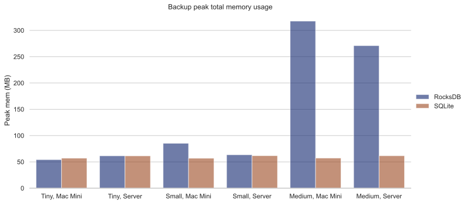

没惊也没喜。我们之前说过，测试框架大概就会用 50MB 内存，所以应该把大概这个数除去。

从备份恢复
~~~~~~~~~~~~~~~~~~~~~

从备份恢复，大概速度如何呢？

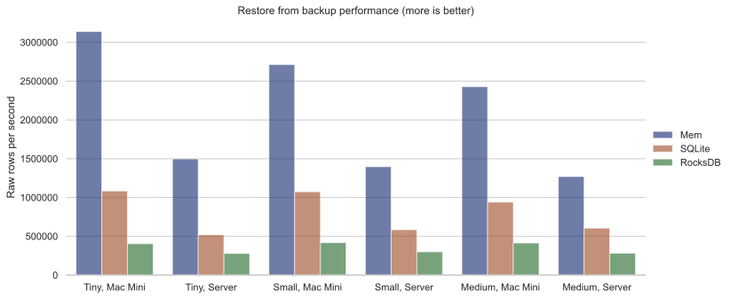

在所有的测试中，这是唯一一个 RocksDB 比其它两个引擎慢的测试，大概只能达到每秒 40 万行。恢复到 SQLite 很快，但是实际上可以更快：我们前面已经说过了，直接把文件拷贝一份就好（或者如果你不打算写入数据的话，连拷贝都不用，直接用）。

内存峰值：

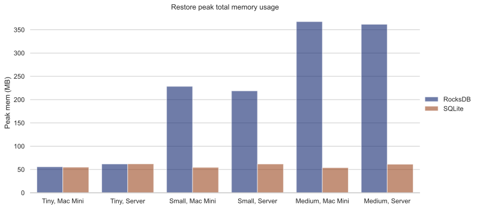

如所料。

事务性查询（OLTP）
----------------------------

事务性查询（OLTP）指的是对数据简单的读或写，影响的行数小，单个查询返回速度快。

单点读
~~~~~~~~~~

我们来测试能想到的最简单的查询：给出一个随机的 ID，返回整条数据：

::

   ?[cmpl_pct, gender, age] := *user{uid: $id, cmpl_pct, gender, age}

我们用来反映性能的指标是每秒执行次数（QPS）：

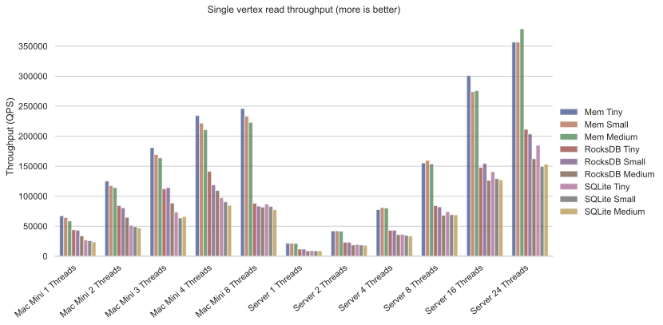

我们可以看出，对于单点查询来说，数据集本身多大对性能影响不大，而线程数量与性能的相关基本是线性的，直到用完处理器所有的性能核为止（这里 Mac Mini 才分性能核与功效核，而其功效核在这里可以看出基本没什么用，甚至有反作用）。基本来说，在充分利用资源的情况下，每秒 10 万次查询对什么机器问题都不大。

峰值内存：

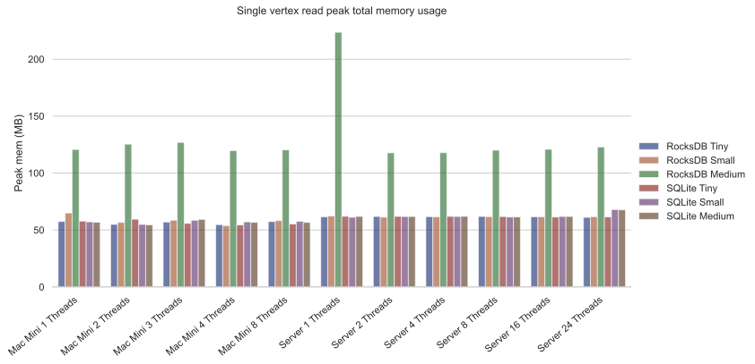

   Single vertex read mem

只有到了中型集的时候，RocksDB 才开始积极使用内存，其他情况下都是能省则省。

单点写
~~~~~~~~~~~

最简单的写操作，写入一个新的端点：

::

   ?[uid, cmpl_pct, gender, age] <- [[$id, 0, null, null]] :put user {uid => cmpl_pct, gender, age}

以下只有 RocksDB 我们才展示多线程的性能，因为其他的引擎实际上都是用锁把写入变成单线程的：

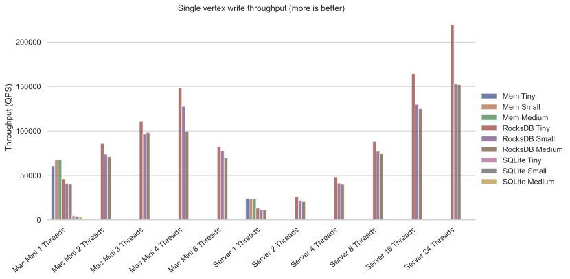

RocksDB 这里的性能超群：Mac Mini 和服务器上都达到了每秒 10 万次以上。注意如果线程数量超过了性能核的数量，在 Mac Mini 上对性能会有不少的负面影响，所以尽量避免这种情况出现。另外，SQLite 的柱子根本看不见，是不是？我们用对数轴再来看看：

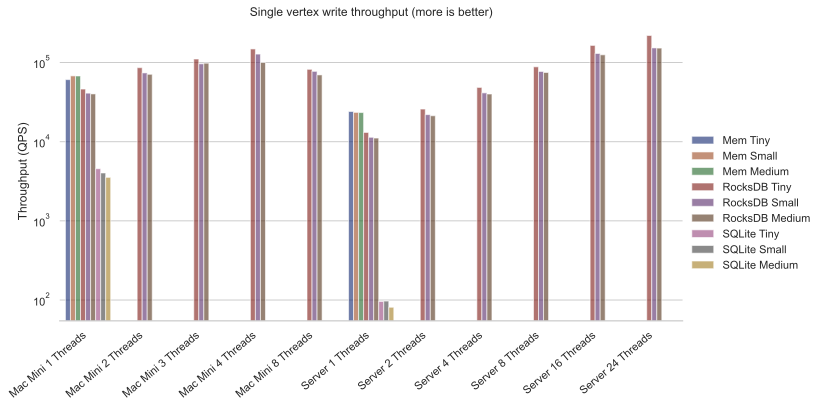

RocksDB 每秒能处理 10 万次，结果 SQLite 在服务器上处理 100 次都困难？这整整慢了 1000 倍都不止！我们知道，SQLite 的写事务本来就慢得很，而由于我们测的就是单点写，这里每次操作都必须作为 SQLite 的写事务来执行，没有别的办法。所以我们只能建议如果你需要大量的并行写入，别用 SQLite。

内存峰值：

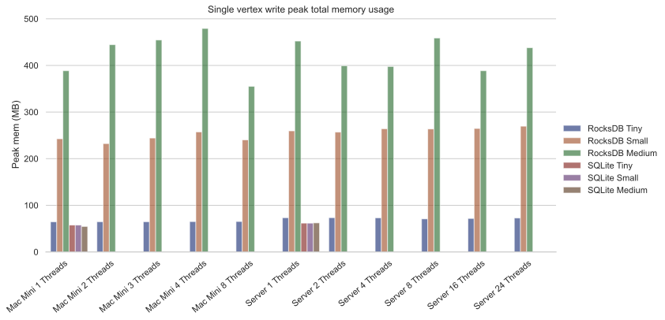

成绩不错。即使是对中型集进行写入，RocksDB 用的内存也不超过 500MB。

单点改
~~~~~~~~~~~~

这里我们更改指定行中一列的值：

::

   ?[uid, cmpl_pct, age, gender] := uid = $id, *user{uid, age, gender}, cmpl_pct = $n
   :put user {uid => cmpl_pct, age, gender}

性能如下：

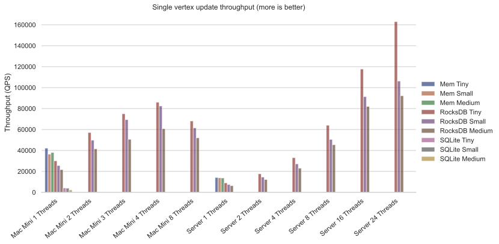

改比写慢，但是慢不过一倍。用 RocksDB 引擎的话，每秒 5 万次仍然很轻松。内存峰值与写操作差不多：

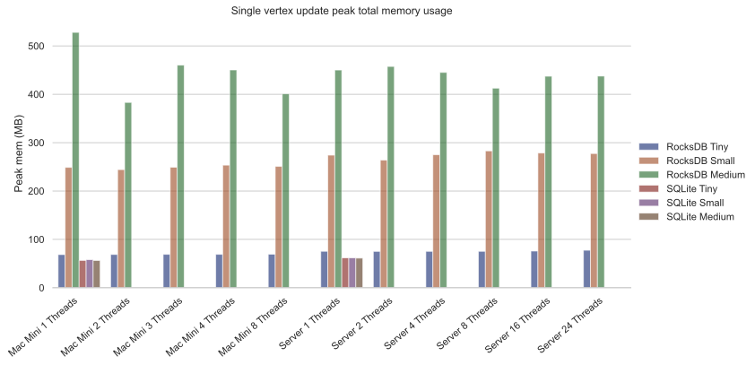

混合查询
~~~~~~~~~~~~~~

当然，在实际应用中，读、写、改一般是同时来的。这里我们就不展示具体数据了，基本结论是 RocksDB 引擎对读写改的性能都差不多，不同配比对其影响不大，但写和改只要一多 SQLite 就跑不动了。详情看 :download:`文件 <files/cozo_perf.xlsx>` 。

你可能会疑惑：上面的测试基本上说明 SQLite 的写性能不好，那干嘛还要用它？原因是在移动端的应用场景下，这样的性能其实也能用，尤其是当批量而不是单点写入的时候。另外 SQLite 真的是一比特多余的内存都不用。

分析型查询（OLAP）
-------------------------

一般来说，分析型查询（OLAP）一次影响很多行数据，也可能会对这些数据进行复杂的计算，返回的行数也可能很多。所有的图查询都可以认为是分析型查询。

对于分析型查询来说，最重要的指标是延迟，即查询提交后（平均）多久会返回结果。

层层都有朋友
~~~~~~~~~~~~~~~~~~

最简单的图查询就是找出某个人所有朋友的朋友都有谁。在这个查询中，第一层朋友的结果必须缓存起来（一般是缓存在内存里）。以下查询我们只给出对于中数据集的结果（160 万个节点，3200 万条边）。如果对更小的数据集做测试，则延迟低得多。文件里有详情。

首先我们来看“二段跳”的结果：朋友的朋友

::

   ?[to] := *friends{fr: $id, to: a}, *friends{fr: a, to}

平均下来，每个人有大概几百个这种二阶友。性能：

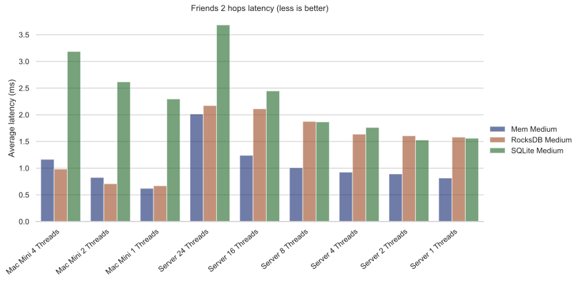

RocksDB 性能一如既往地好。当硬盘足够快的时候，它甚至比纯内存存储还快。由于这是只读查询，所以 SQLite 性能也不错。多线程操作会提高延迟，但是不多。

峰值内存： |Friends 2 mem|

与前面一样，SQLite 一点儿内存都不多用，多线程的时候例外。RocksDB 用的内存也不多。

接下来看三阶友的查询：

::

   l1[to] := *friends{fr: $id, to}
   l2[to] := l1[fr], *friends{fr, to}
   ?[to] := l2[fr], *friends{fr, to}

三阶友的数量的方差极大，平均下来每个人有几千个三阶友，但是某些人的三阶友达到了几万个或更多。延迟如下：

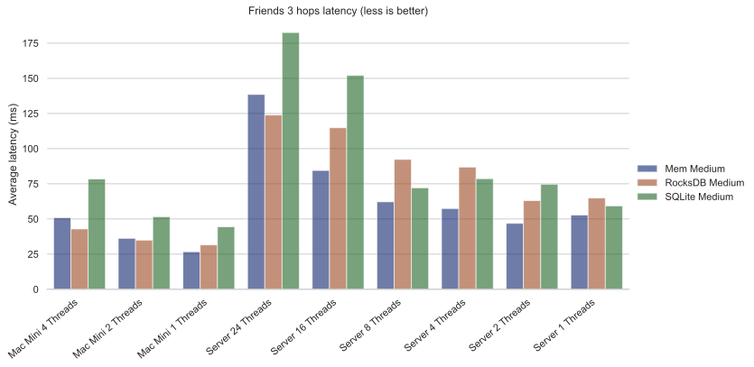

各个不同设置之间的的性能比与二阶差不多，但是整体上延迟时二阶的 20 倍。这也是大约返回数量的比。

内存峰值：

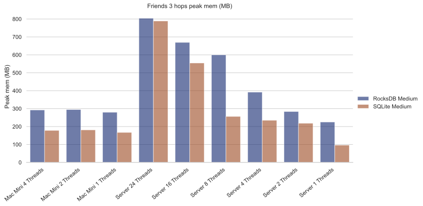

因为返回数据时，所有的数据都必须在内存中，所以在所有配置下内存使用都比之前多。但是即使在开了 24 线程的服务器上，所用内存也不到 1GB。

下面我们看四阶友：

::

   l1[to] := *friends{fr: $id, to}
   l2[to] := l1[fr], *friends{fr, to}
   l3[to] := l2[fr], *friends{fr, to}
   ?[to] := l3[fr], *friends{fr, to}

返回行数的方差现在大得惊人：孤僻的人只有几千个四阶友，但社牛们的四阶友差不多是整体人群的一半多！

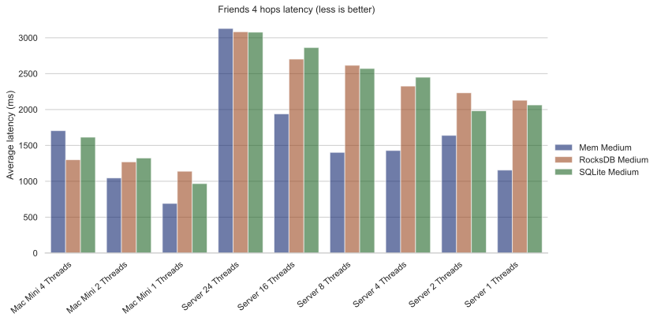

对于社牛来说，几秒就能数出自己几十上百万个四阶友，不错了。

内存峰值直接与返回集合大小挂钩：

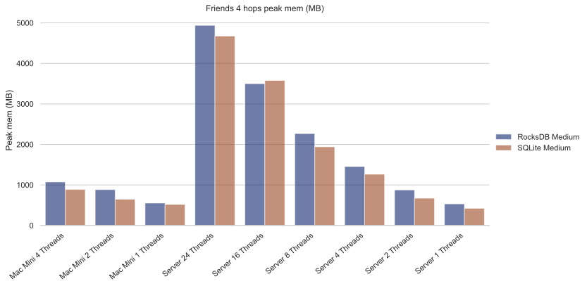

再往上剩阶意义不大了，因为根据“六度空间”理论，到了六阶的时候基本上返回值永远是全集。实际上在五阶的时候返回全集的概率就不小了。

聚合查询
~~~~~~~~~~~~

对于数据库来说，聚合查询与图查询不同，是另一种挑战：内存中需要保存的数据很少（如果是计数只需要保存一个值），但是必须扫描表中所有行才能得出结果。我们只给出对于中型集（160 万行）的结果。

首先，我们查询不同年龄都有多少人：

::

   ?[age, count(uid)] := *user{uid, age}

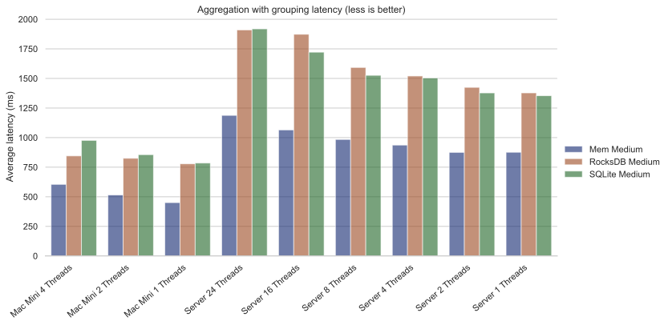

这实际上测试的是单核 CPU 性能与数据读取性能。不论什么设置，1 秒内能扫一百多万的表。

由于内存中不需要存额外的数据，峰值内存很小：

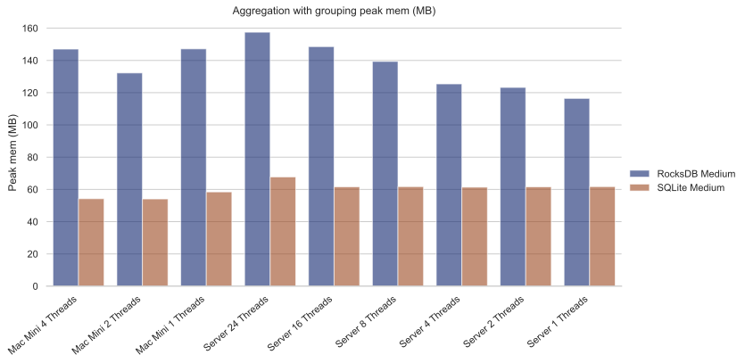

接下来我们在上面查询中加入一个规律：

::

   ?[age, count(age)] := *user{age}, age ~ 0 >= 18

过滤需要花费一些计算时间，但和之前的性能是同一个数量级的： |Aggregation filter latency|

峰值内存和之前雷同：

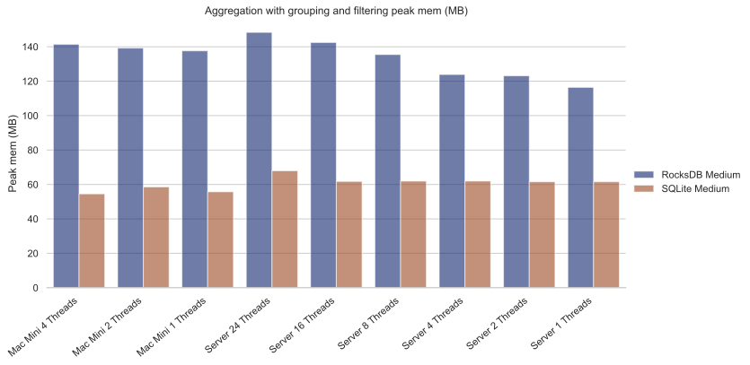

不论同时做多少个聚合操作，结果都差不多，比如：

::

   ?[min(uid), max(uid), mean(uid)] := *user{uid, age}

延迟： |Aggregation stats latency|

峰值内存： |Aggregation stats mem|

佩奇指数
~~~~~~~~

最后让我们看看内置算法的性能：佩奇指数算法

::

   ?[] <~ PageRank(*friends[])

我们会展示不同大小数据集的结果。首先是微型集（1 万个顶点，12 多万条边）：

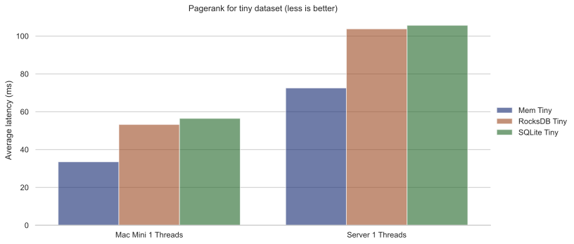

一眨眼就算完了。峰值内存：

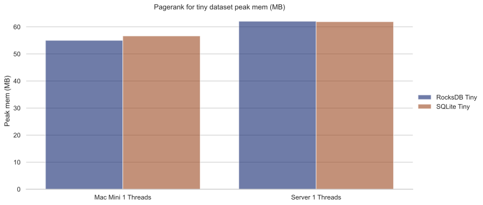

用得很少。接下来是小型集（10 万个顶点，170 万条边）：

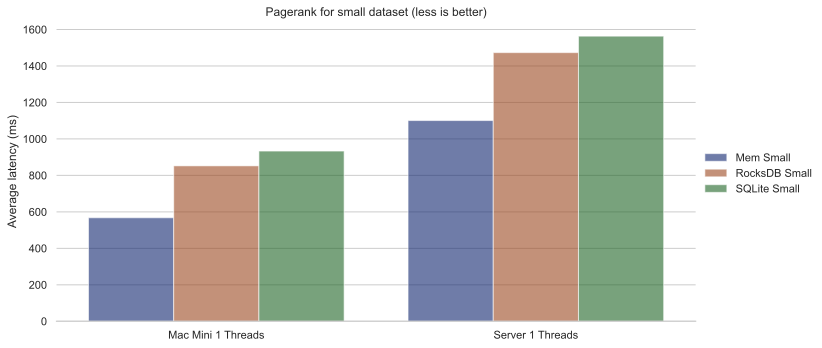

一秒的上下一倍之内。峰值内存：

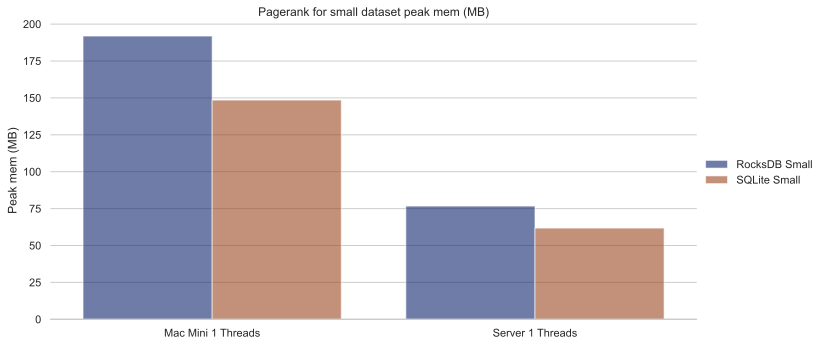

实际上所用内存基本就是把整个图使用特殊格式存在内存里占用的量（比存储格式用得少）。

全数据集（160 多万个顶点，3200 多万条边）：

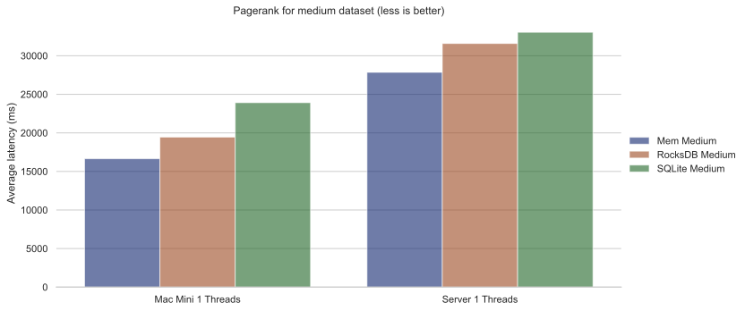

不管什么设置，半分钟都跑完了。实际上世界上最快的佩奇指数实现大概也不会快太多。峰值内存：

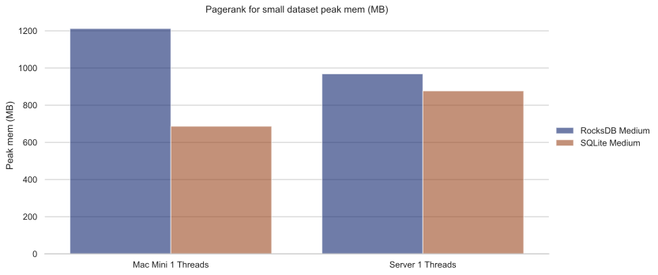

这个量级的图用了差不多 1GB 内存，比较合理。

结论
----------

我们可以看出，Cozo 性能强劲，同时资源占用少。Cozo 又基本哪儿都能跑。所以你还有什么不用的理由呢？我们期待你使用后的反馈。

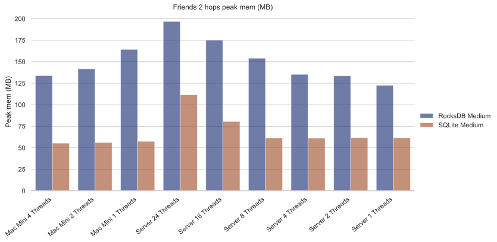
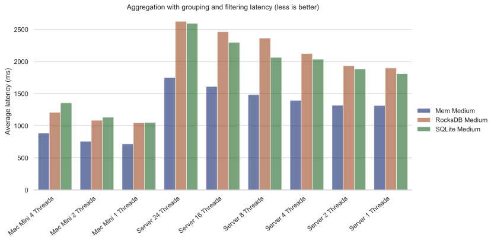
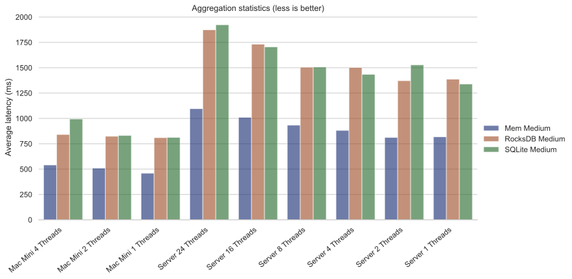
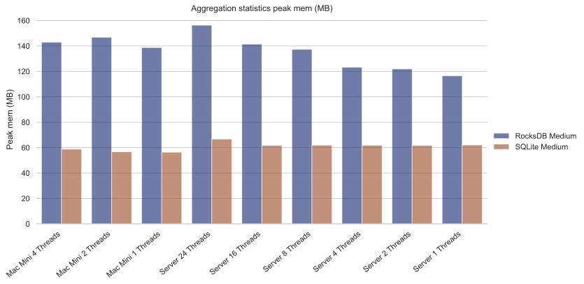
